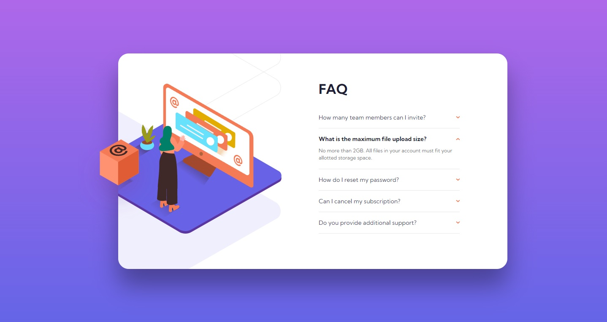

# Frontend Mentor - FAQ accordion card

This is a solution to the [FAQ accordion card challenge on Frontend Mentor](https://www.frontendmentor.io/challenges/faq-accordion-card-XlyjD0Oam). Frontend Mentor challenges help you improve your coding skills by building realistic projects.  

## Table of contents

- [Overview](#overview)
  - [The challenge](#the-challenge)
  - [Screenshot](#screenshot)
  - [Links](#links)
- [My process](#my-process)
  - [Built with](#built-with)
  - [What I learned](#what-i-learned)
  - [Continued development](#continued-development)
  - [Useful resources](#useful-resources)
- [Author](#author)

## Overview

### The challenge
- Responsive layout card with frequently asked questions (FAQ) formed as a accordion.
- Users should be able to:
    - View the optimal layout for the component depending on their device's screen size
    - See hover states for all interactive elements on the page
    - Hide/Show the answer to a question when the question is clicked

### Screenshot
<div>
  
  
</div>

### Links

- Solution URL: [My solution URL](https://github.com/MiloosN5/FrontendMentor_FAQ__Accordion_Card_Challenge)
- Live Site URL: [My live site URL](https://miloosn5.github.io/ProfileCardComponent_Challenge/)


## My process

### Built with

- Semantic HTML5 markup
- SASS - compiled into the CSS
- BEM
- Flexbox
- Grid
- Mobile-first workflow
- REM (Root EM) & EM (for Responsive)
- Responsive layout
- NPM
- Webpack 

### What I learned

* This project has two main tasks - building accordion for frequently common questions (FAQ) & accurate positioning of the elements.
* Positioning:
    Positioning in this challenge is tricky. There is need to find relation between several elements - illustration, shadow, box & main card. 
    The layout is consists of two main parts: decorative_images & content(questions). Both parts are positioned relative to its parent. However, in their relation, we have overlapping. We can achieve this with setting negative value for margin-top of the content part. 
    Decorative_images part will be divided into two groups: illustration+shadow wrapper and box. Reason for separating illustration and shadow from box lay in the desktop layout, where we need to hide illustration+shadow beyond FAQ container but keep full image of box. Since the illustration is the main thing here, we will observe everything in relation to it. Its position will be set to be 'relative'. Shadow & box depends on the illustration, so their position will be set to 'absolute' in order to follow illustration. Important thing to mention that in our case, 'shadow' & 'box' as absolute, depend on their parent. Illustration is not their parent. Parent for 'shadow' is wrapper for illustration+shadow, and parent for 'box' is 'decorative_images' where all them is grouped together. 
    **Desktop**
    When layout reached desktop breakpoint, relations stayed the same but there are difference in some other settings. These settings includes: width, paddings, margins and such things. In desktop scenario, our box email & whole wrapper need to move when clicking. Since the 'box email' image includes extra parts and we need for clicking only on box, its better include svg code in html instead of img. In our case, box code is grouped inside <g> tag (svg > g). Movement is done using addEventListener in JavaScript.   

      * hierarchy of images
          ```html
              <div class="FAQ__decorative-images">
                  <!-------------------------------------------- illustration -------------------------------------------->
                  <div class="FAQ__illustration-shadow-wrapper">
                      <picture class="FAQ__illustration">
                          <source media="(min-width: 70em)" srcset="../src/images/illustration-woman-online-desktop.svg" >
                          
                      </picture> 
                      <!-------------------------------------------- shadow -------------------------------------------->
                      <picture class="FAQ__shadow" >
                          <source media="(min-width: 70em)" srcset="../src/images/bg-pattern-desktop.svg" >
                          
                      </picture> 
                  </div> 
                  <!-------------------------------------------- box -------------------------------------------->
                  <picture class="FAQ__box" >
                      <svg width="100%" height="100%" viewBox="0 0 191 184" ...><g transform="translate(50.93 2.125)">...</g></svg>
                  </picture>
              </div>                 
          ```
* Accordion:
    The way that accordion work is that you can toggle between showing & hidding answer for the particular question. There is two way that we can implement our accordion functionality. One of the way is to allow only one open answer at the time. Another way is that question doesn't depend on the other questions - all can be open in the same time. First way was choosed here. In order to make these questions functional, we can use 'radio buttons'. Purpose of radio buttons is to allow user to select only one option at the time. **Note** If you decide to use second way for accordion, you can done it with 'checkbox'. 
    Strength of the SASS can be also seen in this example. We can implement 'click event' in SASS without any help of JavaScript. Since the input (our radio button) has attribute checked, we can check if the button is clicked or not. If its value is "true" we can do something. There is two things that we need to change. When the button is clicked, we need to rotate our "arrow" image that is placed next to question. It can be done using 'transform' property and rotate(-180deg). In our "input[name="accordion"]:checked" selector, we need to use "Adjacent sibling selectors (+)". This select first element of certain type that is placed immediately after the reference element but within the same parent.
    Second, we need to show answer. In order to do this, firstly we need to set max-height & opacity to '0'. Then, when button is cliked, we use "General sibling selectors (~)" to select all elements of certain type that is placed after the reference element within the same parent. When using this selector, wanted element doesn't need to be immediately preceded by reference element. Inside this selector, we will set max-height to '100vh' and opacity to '1'.

      * questions
        ```html
            <div class="FAQ__question">
                <input type="radio" id="q2" name="accordion" checked="checked">
                <label  class="FAQ__label" for="q2">What is the maximum file upload size? 
                    
                </label>
                <div class="FAQ__answer">No more than 2GB. All files in your account must fit your allotted storage space.</div>
            </div>
        ```
  
      * click event simulation
          ```sass
                input[name="accordion"]:checked {
                    + .FAQ__label {
                        img {
                            transform: rotate(-180deg);
                        }
                    }
                    ~ .FAQ__answer {
                        @extend %maxHeight-100vh;
                        @extend %opacity-1;
                        @include a.padding('pi-FAQ__answer', 'pb-FAQ__answer');
                    }
                }                                
          ```                    

### Continued development

* In-depth explorating of Webpack & Sass.
* Aspiration to make better responsive layout.
* Aspiration to make better SASS organization.
* Tending to improve BEM naming convention.

### Useful resources

- [Webpack Course - Colt Steele (Youtube)](https://www.youtube.com/playlist?list=PLblA84xge2_zwxh3XJqy6UVxS60YdusY8) - Webpack configuration - really helpful to understand difference between 'development' & 'production' configuration. Also, comprehensible explanations and straight to the point.
- [Webpack - Official documentation](https://webpack.js.org/) - Webpack official documentation - everytime you struggle with understanding something about webpack (ex. plugins), there you can found explanation. 
- [BEM](https://en.bem.info/) - BEM naming convention is also really important for any projects, expecially the bigger ones.
- [SASS](https://sass-lang.com/documentation/at-rules) - You can found detailed documentation on the official page of the SASS. Check out for example "at-rules".
- [7-1 pattern SASS](https://sass-guidelin.es/#component-structure) - "7-1" pattern is one of the most used sass organization. It is also very pratical. 
- [Clamp calculator](https://royalfig.github.io/fluid-typography-calculator/) - Since there are so many different devices, desirable is to make your font fluid from one size to another.
- [Fluid-responsive property calctor](https://websemantics.uk/tools/fluid-responsive-property-calculator/) - One of the main difference that the one above is that accept negative values.
- [Media Query](https://css-tricks.com/a-complete-guide-to-css-media-queries/) - A Complete Guide to (CSS) Media Queries.
- [Responsive images](https://developer.mozilla.org/en-US/docs/Learn/HTML/Multimedia_and_embedding/Responsive_images) - How to make images responsive.
- [Typographic Hierarchy](https://www.toptal.com/designers/typography/typographic-hierarchy) - Understanding your website structure/hierarchy sometimes can be difficult. Determing accurately typography can be half job done. 
- [An Introduction to Block Element Modifiers (BEM)](https://opensenselabs.com/blog/articles/introduction-block-element-modifiers) - Difference between Block, Modifier and Element.
- [Understanding CSS BEM](https://codeburst.io/understanding-css-bem-naming-convention-a8cca116d252) - Examples of how BEM class namings can be done.
- [BEM Grandchildren](https://scalablecss.com/bem-nesting-grandchild-elements/) - Handling naming of the nesting elements.
- [BEM 101](https://css-tricks.com/bem-101/) - Another source about BEM.
- [Maps](https://sass-lang.com/documentation/values/maps/) - Useful for storing values that later will be connected with eg. mixins.
- [+ ~ selectors](https://stackoverflow.com/questions/26282375/difference-between-the-selectors-div-p-plus-and-div-p-tilde) - Difference between "+" & "~".
- [Pure CSS Accordion](https://codepen.io/raubaca/pen/PZzpVe) - Implement accordion only with using CSS.

## Author

- GitHub - [MiloosN5](https://github.com/MiloosN5)
- Frontend Mentor - [@MiloosN5](https://www.frontendmentor.io/profile/MiloosN5)


